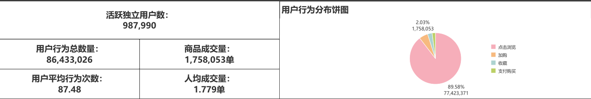
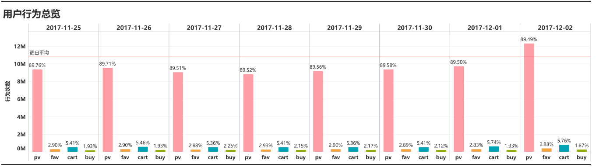
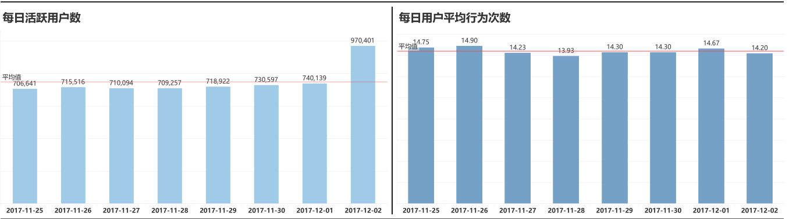
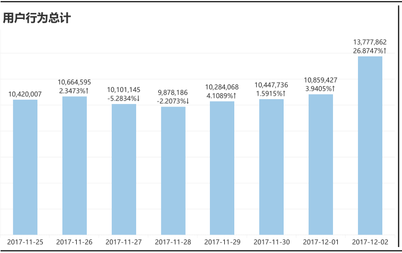
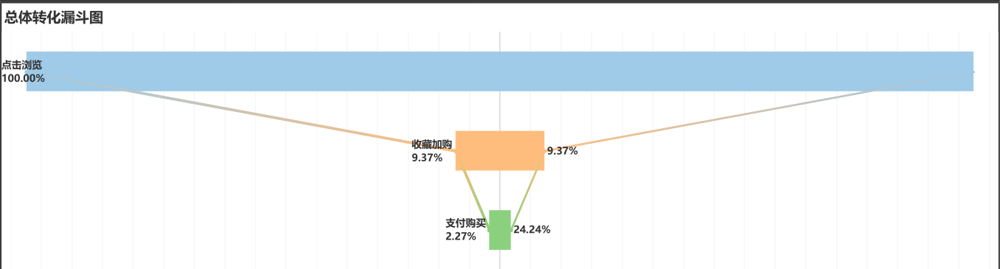
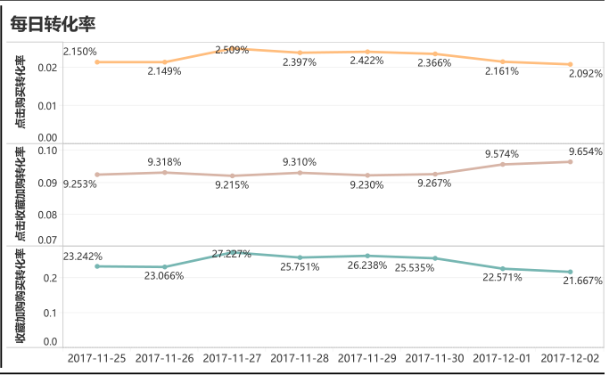
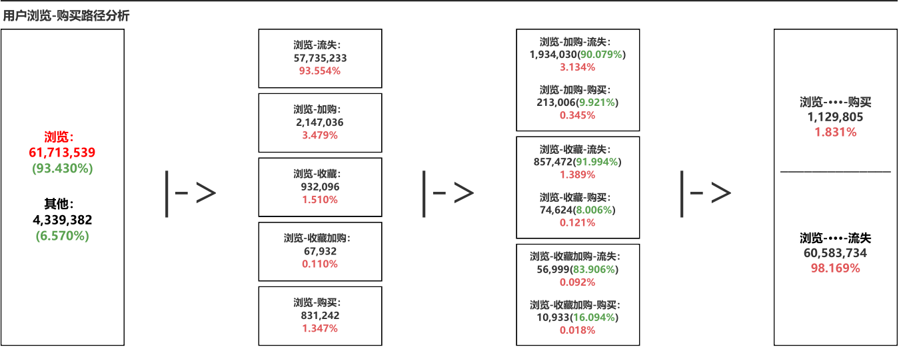

# 天池淘宝用户行为数据分析
很久没做数据方面的分析和报表的制作了，先拿个淘宝行为复健一下。

——————————————————————————————————————————————————————\
开发使用：python pandas + mysql + tableau\
因为这个淘宝天池数据量有一个多亿，因此在个人电脑上必须使用python进行处理，整合数据并统一成聚合字段才能导入数据库（过大的数据导入会爆内存）。\
\
数据范围：2017年11月25日-2017年12月02日\
数据集介绍：数据集包含了2017年11月25日至2017年12月3日之间，有行为的约一百万随机用户的所有行为（行为包括点击、购买、加购、喜欢）。一共包含五个字段：
| 列名称 | 说明|
|:-------|:-------|
|用户ID|整数类型，序列化后的用户ID|
|商品ID|整数类型，序列化后的商品ID|
|商品类目ID|整数类型，序列化后的商品所属类目ID|
|行为类型|字符串，枚举类型，包括('pv', 'buy', 'cart', 'fav')|
|时间戳|行为发生的时间戳|

下面是有关行为类型的说明：
|行为类型|说明|
|:-----|:-----|
|pv|商品详情页pv，等价于点击浏览|
|buy|商品购买|
|cart|将商品加入购物车（简称：加购）|
|fav|收藏商品|

数据量说明：
|维度|数量|
|:------|:------|
|用户数量|987,994|
|商品数量|4,162,024|
|用户数量|987,994|
|商品类目数量|9,439|
|所有行为数量|100,150,807|

本次使用的日期范围是到2017年12月02号，因此总的数据量在八千六百万左右，此外，2017-11-25是周六，时间上从周六一直到下周六（也就是2017-12-02）一共八天的时间。

## 分析思路
我们从一下几个方面进行分析：
### 第一部分 数据总览
建立总行为数、总成交量、活跃用户量、每日活跃用户量、用户平均行为次数、人均成交量、每日用户行为次数以及单日人均行为次数的指标体系，从多个维度监控统计时间内数据的总体情况以及时期内每天的波动情况，有利于及时发现异常的数据波动，同时，也能反映平台吸引用户的能力以及用户的粘性和忠诚度。

分析：从上述图中可以观察到2017-11-25到2017-12-02期间的用户行为数据，也就是从一周周六到下周周六当天的数据。其中可以发现工作日（从11月26号到12月01号）的用户行为数量较上周末以及这周六都是相对下降的，这符合平常生活实际，由于工作日用户需要进行上班工作，花费在浏览购买商品上的时间也会相对减少。此外，12月02日这天较上周周六（11月25日）这天用户行为数量增加明显，活跃用户数同样也有显著上升，都增长了接近20%，可能的原因是12月2号这周周末平台在举办一些刺激消费的活动，从而拉动了点击购买数量的上涨。每日人均行为次数则是保持平稳，证明用户恶意刷流量的行为发生较少，总体用户行为比较正常。

### 第二部分 行为数据漏斗图和用户路径转化率分析

通过分析数据集中点击浏览、收藏、加购（加入购物车）以及购买的用户行为数据量，制作用户行为漏斗转化图和每日转化率折线图；同时，根据用户行为从浏览-收藏、浏览-加购、浏览-流失、浏览-收藏加购和浏览-购买这五个路径进行单一用户路径分析。

