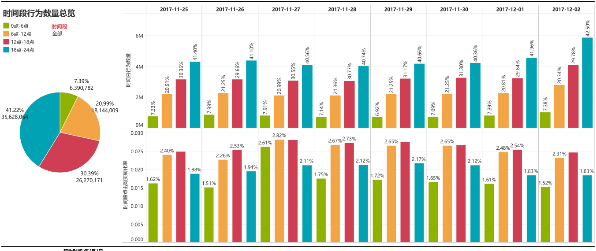
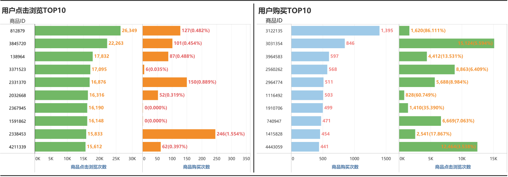

# 天池淘宝用户行为数据分析
很久没做数据方面的分析和报表的制作了，先拿个淘宝行为复健一下。

——————————————————————————————————————————————————————\
开发使用：python pandas + mysql + tableau\
因为这个淘宝天池数据量有一个多亿，因此在个人电脑上必须使用python进行处理，整合数据并统一成聚合字段才能导入数据库（过大的数据导入会爆内存）。\
\
数据范围：2017年11月25日-2017年12月02日\
数据集介绍：数据集包含了2017年11月25日至2017年12月3日之间，有行为的约一百万随机用户的所有行为（行为包括点击、购买、加购、喜欢）。一共包含五个字段：
| 列名称 | 说明|
|:-------|:-------|
|用户ID|整数类型，序列化后的用户ID|
|商品ID|整数类型，序列化后的商品ID|
|商品类目ID|整数类型，序列化后的商品所属类目ID|
|行为类型|字符串，枚举类型，包括('pv', 'buy', 'cart', 'fav')|
|时间戳|行为发生的时间戳|

下面是有关行为类型的说明：
|行为类型|说明|
|:-----|:-----|
|pv|商品详情页pv，等价于点击浏览|
|buy|商品购买|
|cart|将商品加入购物车（简称：加购）|
|fav|收藏商品|

数据量说明：
|维度|数量|
|:------|:------|
|用户数量|987,994|
|商品数量|4,162,024|
|用户数量|987,994|
|商品类目数量|9,439|
|所有行为数量|100,150,807|

本次使用的日期范围是到2017年12月02号，因此总的数据量在八千六百万左右，此外，2017-11-25是周六，时间上从周六一直到下周六（也就是2017-12-02）一共八天的时间。

## 分析思路
我们从一下几个方面进行分析：
### 第一部分 数据总览
建立总行为数、总成交量、活跃用户量、每日活跃用户量、用户平均行为次数、人均成交量、每日用户行为次数以及单日人均行为次数的指标体系，从多个维度监控统计时间内数据的总体情况以及时期内每天的波动情况，有利于及时发现异常的数据波动，同时，也能反映平台吸引用户的能力以及用户的粘性和忠诚度。

分析：从上述图中可以观察到2017-11-25到2017-12-02期间的用户行为数据，也就是从一周周六到下周周六当天的数据。其中可以发现工作日（从11月26号到12月01号）的用户行为数量较上周末以及这周六都是相对下降的，这符合平常生活实际，由于工作日用户需要进行上班工作，花费在浏览购买商品上的时间也会相对减少。此外，12月02日这天较上周周六（11月25日）这天用户行为数量增加明显，活跃用户数同样也有显著上升，都增长了接近20%，可能的原因是12月2号这周周末平台在举办一些刺激消费的活动，从而拉动了点击购买数量的上涨。每日人均行为次数则是保持平稳，证明用户恶意刷流量的行为发生较少，总体用户行为比较正常。

### 第二部分 行为数据漏斗图和用户路径转化率分析

通过分析数据集中点击浏览、收藏、加购（加入购物车）以及购买的用户行为数据量，制作用户行为漏斗转化图和每日转化率折线图；同时，根据用户行为从浏览-收藏、浏览-加购、浏览-流失、浏览-收藏加购和浏览-购买这五个路径进行单一用户路径分析。

分析：\
从总体转化漏斗图中可以发现，从点击浏览到收藏加购的转化率接近百分之十，而从点击浏览到最后购买商品的转化率不到2.5%，只有2.27%，处于正常偏低的水平，而从收藏加购之后到购买的转化也差不多只有四分之一，可以发现平台在对于收藏加购商品之后引导用户购买商品的路径上做得不够深入，需要采取策略引导用户重新审视并发现收藏或者加购的商品的价值，从而引导其下单购买。点击浏览到收藏加购的转化率偏低，说明平台的商品推送或者商品的价格等因素没达到用户的预期，用户在浏览后觉得不合适，不打算进行下一步。平台方需要进一步分析当前用户的画像与搜索行为，提取出用户喜欢的或者需要的商品进行推送，也需要进一步完善平台的推荐算法，使其推荐的内容更符合各种不同用户的实际需要，提高浏览到收藏加购的转化率。
\
从每日的转化率来看，三类转化率都是保持平稳中略有波动，证明这段时间平台的营销策略相对平稳，没有做相对较大的调整。
\
用户浏览-购买路径分析中发现有一部分是没有浏览就进行其他行为，可能是之前收藏好或者加购好的商品在进行点击购买等，跳过这部分。从浏览到购买这五种不同的路径中，可以发现浏览之后直接购买的占比显然要比浏览后经过其他路径再购买的占比要高很多，说明用户在购买商品时更倾向于立即下单，而不是收藏加购同类型不同商品后进行比较再选择购买，可能的原因是用户时间较紧，没有足够的时间进行比价再购买，也能侧面说明平台主要的用户就是这类倾向于直接下单的用户（可以进一步提取其用户公开的信息勾画出对应用户画像）。从该路径分析中也能发现，从加购流向购买和从收藏流向购买的比例接近，而加购和收藏之后流向购买的比例相对就会高很多，体现了用户对于喜爱的商品是有更多的行为。总体上，该路径图体现出来浏览之后就流失掉的占比高达93.5%，说明平台用户浏览后流失严重，也说明了平台侧对于用户真正需求商品的认识和推送不足，导致用户仅浏览而没有下一步动作，这方面需要不断优化。

### 第三部分 用户行为使用习惯

此处将每日时间分为四个部分，分别为：凌晨0-6点、早上6-12点、下午12到18点和晚上18到24点，通过分析每日四个时间段的用户活跃度和路径转化率，可以发现时间对于用户购物的影响以及发现用户在不同时间的行为特征。

分析：从上述两幅用户使用时间段和转化率的分析中可以知道，晚上（18点-24点）是用户最活跃的时间，无论实在工作日还是再周末，占比都在四成左右。但是从转化率柱状图来看，晚上这个时间段点击浏览-购买的转化率不高，比下午和早上都相对较低，猜测可能的原因是一部分用户晚上下班后利用逛淘宝来消遣时间，浏览自己喜欢的内容但是鲜少购买，而上午下午由于上班时间的限制，很多情况下上淘宝买东西都会有明确的目标性，进行购买的情况就会相对较多。从详细数据表中也能看出，早上和下午收藏加购-购买的转化率明显要比晚上的转化率要高，更能体现用户在早上和下午的购物选择是更具有目的性的。

### 第四部分 商品偏好分析和平台推荐分析
从数据中抽取点击量TOP10和购买量TOP10，并同时提取对应的购买量和点击量，以此分析用户对于商品的偏好和平台流量投放的成果。

分析：从上面这副商品偏好分析里面可以看出，点击浏览量TOP10的商品里面其真正转化到到购买上面是比较少的，而且与购买量TOP10里面的商品没有重叠。在用户商品购买量TOP10里面可以看出，人们的购买商品，其浏览-购买的转化率都比较高，甚至有些能到30%以上。以上情况说明，平台投放推荐的商品与用户实际需要的商品出入较大，没有很好的洞悉到用户的本质需求，推荐过多与用户实际需要无关的商品导致浏览量多的商品其购买比例很少。平台需要优化自己的推荐算法，使得购买热门的商品能有更多的曝光量，从而提高商品的销量。
